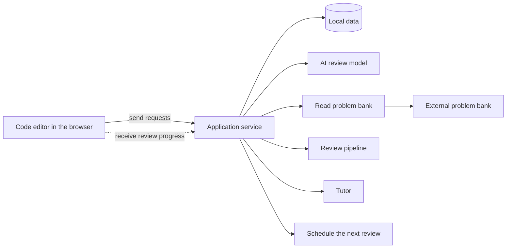
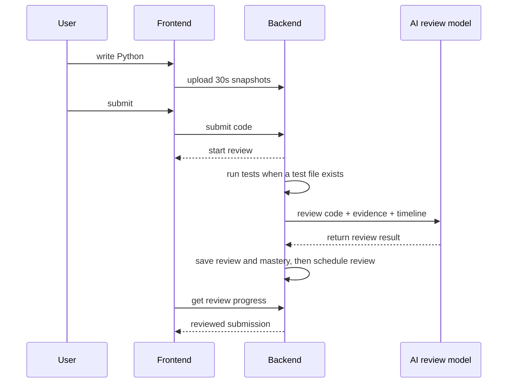

<div align="center">

# EasyCode

**Turn algorithm practice into supervised training.**

Write code locally, run Python tests, get feedback from an AI model, replay your process, ask for guided help, and get a clear plan for when to revisit each problem.

[](https://github.com/Dreamaker-TA/EasyCode/actions/workflows/ci.yml)
[](LICENSE)
[](https://www.python.org/)
[](https://nodejs.org/)
[](https://fastapi.tiangolo.com/)
[](https://react.dev/)
[](https://www.sqlite.org/)

**[Quick Start](#quick-start)** ·
**[Problem Bank](#build-your-own-problem-bank)** ·
**[Configuration](#configuration)** ·
**[Architecture](#architecture)** ·
**[中文](README.zh.md)**

</div>

---

## What EasyCode Is

EasyCode is a local, pluggable practice desk for people who already know the lesson and now need repeated, high-signal practice.

Traditional online judges give you a red or green light. EasyCode records how you got there:

- a built-in code editor, timer, local drafts, and 30-second code snapshots
- Python test results from a matching `.tests.json` file
- AI feedback across five areas: whether the code runs, code quality, complexity, improvements, and process
- a Socratic tutor that gives guided help without exposing the reference answer
- A/B/C/D mastery ratings that determine the next review date
- history replay, Markdown export, and local share-card rendering

---

## Quick Start

### Option A: Docker

Use this if you want the simplest path.

```bash
git clone https://github.com/Dreamaker-TA/EasyCode.git
cd EasyCode
docker compose up --build
```

Open <http://localhost:8000>.

After the first launch, open **Settings** in the app and enter the model service address, model name, and access key to enable AI reviews. The key stays on your machine and is never shown in the page again.

You can also configure it before starting by creating `.env` in the repository root:

```bash
LLM_BASE_URL=https://api.deepseek.com
LLM_API_KEY=sk-your-real-key-here
LLM_MODEL=deepseek-v4-flash
```

Then restart:

```bash
docker compose up --build
```

Docker notes:

| Need | How |
|---|---|
| Persist progress | SQLite lives in the `easycode-data` Docker volume |
| Reset everything, including model settings saved in the app | `docker compose down -v` |
| Use your own problem bank | `PROBLEM_BANK_HOST_PATH=/absolute/path/to/my-bank docker compose up --build` |
| Access app | `http://localhost:8000` |

### Option B: Source Development

Use this if you want hot reload or plan to modify the app.

Prerequisites:

| Tool | Version |
|---|---|
| Python | 3.11+ |
| uv | latest |
| Node.js | 20.19+ |
| pnpm | 10.34.4 |

Bootstrap:

```bash
git clone https://github.com/Dreamaker-TA/EasyCode.git
cd EasyCode
./scripts/bootstrap.sh
```

The bootstrap is one command: it creates `.env` when missing, installs locked
dependencies, imports the sample problem, updates the local database, and seeds the app.
You do not need a model access key for installation.

```bash
make dev
```

Open <http://localhost:5173>. The backend runs at `http://127.0.0.1:8000/api`.
Use the in-app **Settings** page to enter the model service address, model name, and access key to enable reviews, tutoring, and direct problem generation. The key stays on your machine and is never shown in the page again; you can also edit `.env` directly.
If those ports are already taken, keep the same source workflow and choose free
ports:

```bash
BACKEND_PORT=8010 FRONTEND_PORT=5174 make dev
```

---

## Build Your Own Problem Bank

Keep your bank outside this repo:

```text
my-bank/
└─ Code/
   └─ 01_basics/
      ├─ 01_1001_two-sum.md
      ├─ 01_1001_two-sum.tests.json
      └─ 01_1001_two-sum.rubric.md
```

Point EasyCode at it:

```bash
EASYCODE_PROBLEM_BANK_ROOT=/absolute/path/to/my-bank make ingest
make dev
```

In Docker:

```bash
PROBLEM_BANK_HOST_PATH=/absolute/path/to/my-bank docker compose up --build
```

### Recommended: Create with Codex or Claude Code

This repository's project skill is the recommended way to create a problem-bank
entry. It turns an exercise brief into a validated Markdown problem, test file,
and grading rubric.

Start a new agent session from the repository root, then use either:

```text
Codex: $create-easycode-problem-bank Add a beginner array exercise to /absolute/path/to/my-bank.
Claude Code: /create-easycode-problem-bank Add a beginner array exercise to /absolute/path/to/my-bank.
```

The skill lives in [`.agents/skills/`](.agents/skills/create-easycode-problem-bank/SKILL.md)
for Codex and [`.claude/skills/`](.claude/skills/create-easycode-problem-bank/SKILL.md)
for Claude Code. It validates the JSON description before writing and does not overwrite existing entries.

### Alternative: Create with Any AI Assistant

If you cannot use the project skill, give another AI assistant the prompt below,
save its JSON response as `problem.json`, then run:

```bash
make problem-entry-check BANK_ROOT=/absolute/path/to/my-bank SPEC=/absolute/path/to/problem.json
make problem-entry BANK_ROOT=/absolute/path/to/my-bank SPEC=/absolute/path/to/problem.json
EASYCODE_PROBLEM_BANK_ROOT=/absolute/path/to/my-bank make ingest
```

The helper validates the reference Python solution against sample outputs and
derives hidden-case `expected_stdout` from that same program.

```text
Create an EasyCode JSON problem description for an original programming exercise.

Output exactly one JSON object, with no Markdown fences and no extra prose.

Requirements:
- Use this directory style: Code/01_basics/01_1001_problem-title.md.
- Use "source_path" for that relative Markdown path.
- Include "id", "title", and "core".
- Use a stable numeric id whenever possible; the generated Markdown heading will follow "# <id>. <title> [★]".
- Put the public statement, examples, input/output format, and constraints in "statement_md".
- Use `###` headings inside "statement_md"; EasyCode reserves `##` for separating public and reference material.
- Put the explanation in "explanation_md".
- Include a complete runnable Python starter program in "template".
- Include a complete runnable Python reference program in "reference".
- Use checker="token" unless exact formatting or floating-point tolerance matters.
- Include at least 2 sample cases in "samples"; each sample must have "stdin", "expected", and "note".
- Include at least 3 hidden cases in "hidden"; each hidden case needs "stdin" and may include "note".
- Include 3-6 concise grading bullets in "rubric".
- Ensure the reference program really produces every sample "expected" output.
```

If `.env` already contains a working AI model configuration, `make problem-generate BANK_ROOT=/absolute/path/to/my-bank` is an interactive shortcut for this same AI-assisted workflow.

### Manual: Write the Files Yourself

Use this format only when you prefer to maintain the Markdown and sidecar files yourself.

Each problem is a Markdown file under `Code/**/*.md`. A matching `.rubric.md` file holds optional grading criteria; it is not a standalone problem.

```markdown
# 1001. Two Sum ★

## 题目描述

Write the public statement here: input, output, examples, and constraints.

## 解题思路

Write reference explanation here.

## Python 代码

Write a reference solution here.
```

Rules:

| Rule | Meaning |
|---|---|
| First `#` heading | Prefer the standard LeetCode-style numeric format `# <id>. <title> [★]`. A trailing `★` marks it as core. |
| `## 题目描述` | Required. Files without it are not imported. |
| Public statement | From `## 题目描述` to the next `##` heading. |
| Reference material | Everything after the next `##` heading. Used by review/tutor prompts, not exposed as the public statement. |

Recommended title format:

```markdown
# 1001. Two Sum ★
```

For original exercises, assign a stable numeric ID in the same style whenever possible. A plain `# Problem Title ★` heading is accepted when you do not have a stable numeric ID yet, but platform-prefixed or mixed numbering styles are not recommended.

### Optional Test File

Create a sibling `.tests.json` file to enable Python run/submit evidence:

```json
{
  "version": 1,
  "time_limit_ms": 1000,
  "memory_limit_mb": 128,
  "checker": "token",
  "cases": [
    {
      "id": "sample-1",
      "is_sample": true,
      "stdin": "2 3\n",
      "expected_stdout": "5\n",
      "note": "positive integers"
    },
    {
      "id": "hidden-1",
      "is_sample": false,
      "stdin": "-7 4\n",
      "expected_stdout": "-3\n",
      "note": "negative input"
    }
  ],
  "templates": {
    "python": "import sys\n\n\ndef solve(a: int, b: int) -> int:\n    pass\n\n\ndef main() -> None:\n    a, b = map(int, sys.stdin.read().split())\n    print(solve(a, b))\n\n\nif __name__ == \"__main__\":\n    main()\n"
  }
}
```

Field summary:

| Field | Required | Notes |
|---|---:|---|
| `version` | yes | Use `1`. |
| `time_limit_ms` | no | Per-case execution limit. |
| `memory_limit_mb` | no | Informational limit. |
| `checker` | no | Use `token`, `exact`, or `float`; `custom` is reserved and currently falls back to token behavior. |
| `cases` | yes | At least one case. IDs must be unique in the file. |
| `is_sample` | yes | Samples are visible in the UI; hidden cases are used for local execution evidence. |
| `stdin` / `expected_stdout` | yes | Exact program input and expected output. |
| `templates.python` | no | Starter code for function-style practice. |

### Optional Grading-Criteria File

Create a sibling `.rubric.md` file:

```markdown
- Reads exactly two integers and outputs their sum.
- Does not print extra prompt text.
- Runs in O(1) time and O(1) space.
```

After `make ingest`, these criteria guide the AI review.

For the full problem-bank specification, see [PROBLEM_BANK_FORMAT.md](PROBLEM_BANK_FORMAT.md).

---

## Configuration

Important `.env` variables:

| Variable | Purpose | Default |
|---|---|---|
| `LLM_BASE_URL` | Model service address | `https://api.deepseek.com` |
| `LLM_API_KEY` | Model access key | empty |
| `LLM_MODEL` | Model name | `deepseek-v4-flash` |
| `LLM_STRUCTURED_OUTPUT` | `auto`, `json_schema`, `json_object`, or `text` | `auto` |
| `DB_PATH` | SQLite database path | `backend/data/easycode.db` |
| `EASYCODE_PROBLEM_BANK_ROOT` | Source problem bank containing `Code/` | `examples/problem-bank` unless ignored local `./Code` exists |
| `EASYCODE_PROBLEMS_JSON_PATH` | Problem data file created when the bank is imported | `backend/data/problems.json` |
| `PROBLEM_BANK_HOST_PATH` | Host path to the bank that Docker can read | `./examples/problem-bank` |
| `CORS_ORIGINS` | Frontend addresses allowed during source development | common frontend ports |
| `VITE_API_BASE` | Backend address used by the frontend during source development | `http://127.0.0.1:8000/api` |

Provider examples:

```bash
# DeepSeek
LLM_BASE_URL=https://api.deepseek.com
LLM_API_KEY=sk-xxx
LLM_MODEL=deepseek-v4-flash

# OpenRouter
LLM_BASE_URL=https://openrouter.ai/api/v1
LLM_API_KEY=sk-or-xxx
LLM_MODEL=~anthropic/claude-sonnet-latest

# Ollama local
LLM_BASE_URL=http://localhost:11434/v1
LLM_API_KEY=ollama
LLM_MODEL=qwen2.5-coder:14b
```

Provider catalogs change over time. Verify model identifiers in the official
[DeepSeek API docs](https://api-docs.deepseek.com/),
[OpenRouter model catalog](https://openrouter.ai/models), or
[Ollama library](https://ollama.com/library) when configuring a different model.

---

## Daily Commands

| Command | Use |
|---|---|
| `make install` | Install backend and frontend dependencies |
| `make dev` | Run backend and frontend together |
| `make backend` | Run FastAPI only |
| `make frontend` | Run Vite only |
| `make ingest` | Re-import the configured problem bank, update the database, then add its data |
| `make migrate` | Update the database structure |
| `make seed` | Seed DB from generated `problems.json` |
| `make problem-generate` | Interactively generate, validate, and write one problem with the configured AI model |
| `make problem-entry-check` | Preview and validate one generated problem description without writing files |
| `make problem-entry` | Write `.md`, `.tests.json`, and `.rubric.md` from one description |
| `make ci` | Check the frontend code and build, then confirm the backend can run |
| `make runtime-check` | In a temporary directory, verify problem import, database updates, saved data, and core features |
| `make public-audit` | Scan the publishable Git tree for blocked files, unexpected docs, private paths, and secrets |
| `make dependency-audit` | Scan locked frontend and backend dependencies for known vulnerabilities |
| `make compose-check` | Validate Docker Compose configuration without starting containers |
| `make release-check` | Run the complete pre-release check |
| `make bundle-check` | Check the size of the built frontend files |
| `make clean` | Remove dependencies, local database files, and files created during problem import |
| `make docker-up` | `docker compose up --build` |
| `make docker-down` | Stop containers |
| `make docker-clean` | Stop containers and delete data volume |

---

## Architecture



Core flow:



Repository map:

```text
backend/
  app/
    api/          request entry points
    models/       stored data shapes
    schemas/      request and response formats
    services/     review, review planning, tutor, and problem-bank logic
    db/           database connection
  alembic/        database update history

frontend/
  src/
    pages/        app screens
    components/   reusable interface pieces
    hooks/        page state and request logic
    api/          backend communication code
    styles/       global styles and design variables

examples/problem-bank/   one tiny sample bank
scripts/                 bootstrap, ingest, generation, and release checks
```

---

## Validation

```bash
cd frontend && pnpm install --frozen-lockfile
pnpm typecheck
pnpm build
cd .. && node scripts/check_frontend_bundle.mjs

make runtime-check
```

Before publishing, run the repeatable release gate:

```bash
make release-check
```

---

## FAQ

### Why is my AI review failing?

Check `LLM_BASE_URL`, `LLM_API_KEY`, and `LLM_MODEL`. The most common mistake is copying a key with extra backticks, quotes, or a list prefix. Values in `.env` should be bare literals:

```bash
LLM_API_KEY=sk-xxx
```

### What happens if the AI model is unavailable?

The submission is preserved. Review falls back to a retryable failed state with no rating, so an unreliable review never changes your review plan.

### Where is my data?

By default, SQLite lives at `backend/data/easycode.db`. In Docker, it lives in the `easycode-data` volume.

---

## Contributing

Pull requests are welcome.

- Keep problem banks, generated DB files, and local secrets out of the repo.
- Run `make runtime-check` for behavior changes.
- Database-structure changes need a matching Alembic update.
- Changes to AI instructions or the review flow should also update `backend/app/services/prompts/VERSION`.
- Run `make release-check` before opening a pull request.

---

## License

[MIT](LICENSE)
