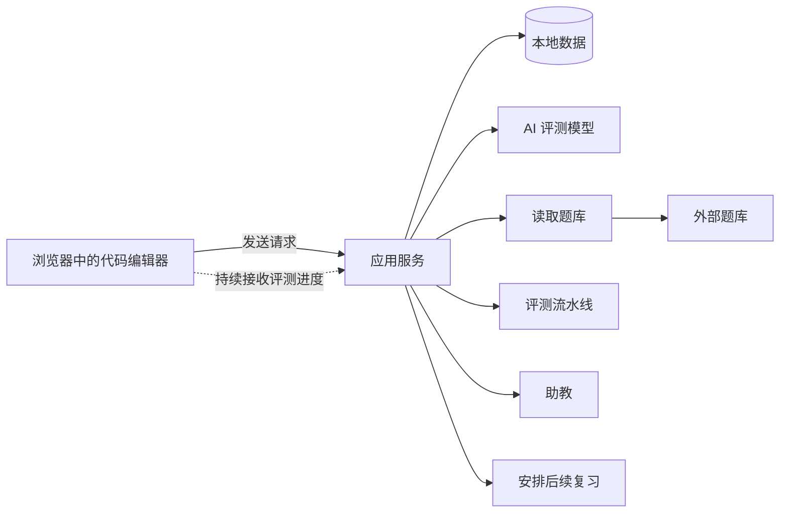
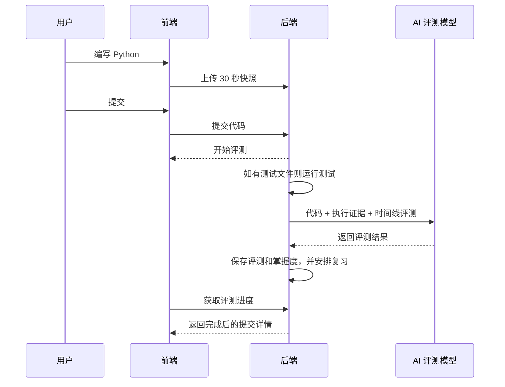

<div align="center">

# EasyCode

**把刷题变成被指导的练习。**

本地写题、本地运行 Python 测试，让 AI 复盘你的代码和解题过程；系统再根据掌握情况安排下一次复习。

[](https://github.com/Dreamaker-TA/EasyCode/actions/workflows/ci.yml)
[](LICENSE)
[](https://www.python.org/)
[](https://nodejs.org/)
[](https://fastapi.tiangolo.com/)
[](https://react.dev/)
[](https://www.sqlite.org/)

**[快速开始](#快速开始)** ·
**[自建题库](#自建题库)** ·
**[配置](#配置)** ·
**[架构](#架构)** ·
**[English](README.md)**

</div>

---

## EasyCode 是什么

EasyCode 是一个跑在你电脑上的算法训练桌。它适合已经看过讲解、现在需要反复动手练习并形成复习节奏的人。

普通在线判题只给红灯或绿灯。EasyCode 关心的是你如何得到这个结果：

- 内置代码编辑器、计时器、本地草稿，以及每 30 秒一次的代码快照
- 通过与题目同名的 `.tests.json` 测试文件提供 Python 运行结果
- AI 从五个方面评测：能否运行、代码质量、复杂度、优化建议和解题过程
- 苏格拉底式助教：给提示，但不直接暴露参考答案
- A/B/C/D 掌握度评级，据此安排后续复习时间
- 历史回放、Markdown 导出、本地分享卡片生成

---

## 快速开始

### 方案 A：Docker

如果只想尽快跑起来，推荐使用 Docker（把运行环境打包好的一种启动方式）。

```bash
git clone https://github.com/Dreamaker-TA/EasyCode.git
cd EasyCode
docker compose up --build
```

打开 <http://localhost:8000>。

首次启动后，打开应用右上角的“设置”，填写模型服务地址、模型名称和访问密钥，即可启用 AI 评测。访问密钥只保存在本机，网页不会再次显示它。

也可以在启动前，在仓库根目录创建 `.env`：

```bash
LLM_BASE_URL=https://api.deepseek.com
LLM_API_KEY=sk-your-real-key-here
LLM_MODEL=deepseek-v4-flash
```

然后重启：

```bash
docker compose up --build
```

Docker 常用项：

| 需求 | 做法 |
|---|---|
| 保留练习进度 | 数据保存在 Docker 的 `easycode-data` 数据卷中 |
| 清空所有数据（包括网页保存的模型设置） | `docker compose down -v` |
| 使用自己的题库 | `PROBLEM_BANK_HOST_PATH=/absolute/path/to/my-bank docker compose up --build` |
| 访问应用 | `http://localhost:8000` |

### 方案 B：源码开发

如果你要改代码或需要热更新，用源码方式。

依赖：

| 工具 | 版本 |
|---|---|
| Python | 3.11+ |
| uv | latest |
| Node.js | 20.19+ |
| pnpm | 10.34.4 |

初始化：

```bash
git clone https://github.com/Dreamaker-TA/EasyCode.git
cd EasyCode
./scripts/bootstrap.sh
```

初始化只需一个命令：缺少 `.env` 时自动创建，随后安装锁定依赖、摄取示例题、
更新本地数据结构并写入初始数据。安装阶段不需要配置模型访问密钥。

```bash
make dev
```

打开 <http://localhost:5173>。应用默认连接到 `http://127.0.0.1:8000/api`。
之后可在应用内“设置”页填写模型服务地址、模型名称和访问密钥，启用评测、助教和直接题目生成。访问密钥只保存在本机，网页不会再次显示它；也可以直接编辑 `.env`。
如果默认端口已被占用，可以仍然使用同一套源码流程，只换空闲端口：

```bash
BACKEND_PORT=8010 FRONTEND_PORT=5174 make dev
```

---

## 自建题库

建议把题库放在项目外部：

```text
my-bank/
└─ Code/
   └─ 01_basics/
      ├─ 01_1001_two-sum.md
      ├─ 01_1001_two-sum.tests.json
      └─ 01_1001_two-sum.rubric.md
```

让 EasyCode 读取它：

```bash
EASYCODE_PROBLEM_BANK_ROOT=/absolute/path/to/my-bank make ingest
make dev
```

Docker 使用外部题库：

```bash
PROBLEM_BANK_HOST_PATH=/absolute/path/to/my-bank docker compose up --build
```

### 首选：用 Codex 或 Claude Code 建题

仓库内置的项目 skill 是创建题库条目的首选方式：它会把题目需求变成经过校验的 Markdown 题目、测试文件和评分要求文件。

请从仓库根目录开启新会话，然后使用：

```text
Codex：$create-easycode-problem-bank 在 /absolute/path/to/my-bank 中添加一道入门数组题。
Claude Code：/create-easycode-problem-bank 在 /absolute/path/to/my-bank 中添加一道入门数组题。
```

Codex 读取 [`.agents/skills/`](.agents/skills/create-easycode-problem-bank/SKILL.md)，
Claude Code 读取 [`.claude/skills/`](.claude/skills/create-easycode-problem-bank/SKILL.md)。skill 会先校验 JSON，再写入文件，且不会覆盖已有题目。

### 备选：给任意 AI 助手提示词

不能使用项目 skill 时，把下面的提示词交给其他 AI 助手，将其 JSON 回复保存为 `problem.json`，然后运行：

```bash
make problem-entry-check BANK_ROOT=/absolute/path/to/my-bank SPEC=/absolute/path/to/problem.json
make problem-entry BANK_ROOT=/absolute/path/to/my-bank SPEC=/absolute/path/to/problem.json
EASYCODE_PROBLEM_BANK_ROOT=/absolute/path/to/my-bank make ingest
```

工具会用参考 Python 程序校验样例输出，并从同一程序生成隐藏用例的 `expected_stdout`。

```text
请为 EasyCode 创建一道原创编程练习的 JSON 格式题目说明。

只输出一个 JSON 对象，不要输出 Markdown 代码围栏，也不要输出额外解释。

要求：
- 使用这种目录风格：Code/01_basics/01_1001_problem-title.md。
- 用 "source_path" 填写这个相对 Markdown 路径。
- 包含 "id"、"title" 和 "core"。
- 尽量使用稳定数字编号；生成的 Markdown 标题会采用 "# <id>. <title> [★]" 格式。
- 在 "statement_md" 中写公开题面、样例、输入输出格式和约束。
- "statement_md" 内部只使用 `###` 小标题；EasyCode 会用 `##` 分隔公开题面和参考材料。
- 在 "explanation_md" 中写参考讲解。
- 在 "template" 中写完整可运行的 Python 起始程序。
- 在 "reference" 中写完整可运行的 Python 参考程序。
- 除非必须精确格式或浮点误差判断，否则使用 checker="token"。
- "samples" 至少包含 2 个样例；每个样例都要有 "stdin"、"expected" 和 "note"。
- "hidden" 至少包含 3 个隐藏用例；每个隐藏用例都要有 "stdin"，也可以有 "note"。
- "rubric" 包含 3-6 条简洁评分标准。
- 确保参考程序确实能产出每个样例的 "expected" 输出。
```

如果 `.env` 已配置可用模型，也可以运行 `make problem-generate BANK_ROOT=/absolute/path/to/my-bank`；它只是同一 AI 辅助流程的交互式快捷入口。

### 手动：自己维护题目文件

仅当你想亲自维护 Markdown 和边车文件时，使用下面的格式。

每道题都是 `Code/**/*.md` 下的一个 Markdown 文件。以 `.rubric.md` 结尾的同名评分要求文件不会被当作题目。

```markdown
# 1001. 两数求和 ★

## 题目描述

这里写公开题面：输入、输出、样例、约束。

## 解题思路

这里写参考讲解。

## Python 代码

这里写参考解。
```

规则：

| 规则 | 含义 |
|---|---|
| 第一个 `#` 标题 | 优先使用标准力扣题号风格：`# <id>. <题名> [★]`。末尾 `★` 表示核心题。 |
| `## 题目描述` | 必填。没有它的文件不会被导入。 |
| 公开题面 | 从 `## 题目描述` 到下一个 `##` 标题。 |
| 参考材料 | 下一个 `##` 标题之后的所有内容。供评测和助教使用，不作为公开题面展示。 |

推荐标题形式：

```markdown
# 1001. 两数求和 ★
```

原创题也建议分配一个稳定数字编号，保持同一格式。如果暂时没有稳定编号，也可以使用普通 `# 题目标题 ★`，但不推荐平台前缀或混合编号风格。

### 测试文件 `.tests.json`

同目录放一个同名 `.tests.json`，即可启用 Python 运行和提交时执行证据。

```json
{
  "version": 1,
  "time_limit_ms": 1000,
  "memory_limit_mb": 128,
  "checker": "token",
  "cases": [
    {
      "id": "sample-1",
      "is_sample": true,
      "stdin": "2 3\n",
      "expected_stdout": "5\n",
      "note": "正整数相加"
    },
    {
      "id": "hidden-1",
      "is_sample": false,
      "stdin": "-7 4\n",
      "expected_stdout": "-3\n",
      "note": "包含负数"
    }
  ],
  "templates": {
    "python": "import sys\n\n\ndef solve(a: int, b: int) -> int:\n    pass\n\n\ndef main() -> None:\n    a, b = map(int, sys.stdin.read().split())\n    print(solve(a, b))\n\n\nif __name__ == \"__main__\":\n    main()\n"
  }
}
```

字段说明：

| 字段 | 必填 | 说明 |
|---|---:|---|
| `version` | 是 | 使用 `1`。 |
| `time_limit_ms` | 否 | 单用例时间限制。 |
| `memory_limit_mb` | 否 | 信息性内存限制。 |
| `checker` | 否 | 使用 `token`、`exact` 或 `float`；`custom` 是保留值，当前会退化为 token 行为。 |
| `cases` | 是 | 至少一个用例。同一文件内 `id` 必须唯一。 |
| `is_sample` | 是 | 样例会在 UI 中展示；隐藏用例用于本地执行证据。 |
| `stdin` / `expected_stdout` | 是 | 程序输入与期望输出。 |
| `templates.python` | 否 | 函数式作答模式的起始代码。 |

### 评分要求文件 `.rubric.md`

同目录放一个同名 `.rubric.md`：

```markdown
- 正确读取两个整数，并输出它们的和。
- 不应输出额外提示文字。
- 时间和空间复杂度都应为 O(1)。
```

运行 `make ingest` 后，评分要求会作为 AI 评测的依据。

完整英文题库规范见 [PROBLEM_BANK_FORMAT.md](PROBLEM_BANK_FORMAT.md)。

---

## 配置

常用 `.env` 变量：

| 变量 | 用途 | 默认 |
|---|---|---|
| `LLM_BASE_URL` | 模型服务地址 | `https://api.deepseek.com` |
| `LLM_API_KEY` | 模型访问密钥 | 空 |
| `LLM_MODEL` | 模型名 | `deepseek-v4-flash` |
| `LLM_STRUCTURED_OUTPUT` | 结构化输出模式：`auto`、`json_schema`、`json_object`、`text` | `auto` |
| `DB_PATH` | SQLite 数据库路径 | `backend/data/easycode.db` |
| `EASYCODE_PROBLEM_BANK_ROOT` | 包含 `Code/` 的题库根目录 | 若存在本地忽略的 `./Code` 则使用它，否则使用 `examples/problem-bank` |
| `EASYCODE_PROBLEMS_JSON_PATH` | 导入题库时生成的题目数据文件 | `backend/data/problems.json` |
| `PROBLEM_BANK_HOST_PATH` | Docker 可访问的宿主题库路径 | `./examples/problem-bank` |
| `CORS_ORIGINS` | 源码开发时允许连接的前端地址 | 常见前端端口 |
| `VITE_API_BASE` | 源码开发时前端连接的后端地址 | `http://127.0.0.1:8000/api` |

常见模型端点：

```bash
# DeepSeek
LLM_BASE_URL=https://api.deepseek.com
LLM_API_KEY=sk-xxx
LLM_MODEL=deepseek-v4-flash

# OpenRouter
LLM_BASE_URL=https://openrouter.ai/api/v1
LLM_API_KEY=sk-or-xxx
LLM_MODEL=~anthropic/claude-sonnet-latest

# Ollama 本地模型
LLM_BASE_URL=http://localhost:11434/v1
LLM_API_KEY=ollama
LLM_MODEL=qwen2.5-coder:14b
```

模型目录会持续变化。切换模型时，请以官方的
[DeepSeek API 文档](https://api-docs.deepseek.com/)、
[OpenRouter 模型目录](https://openrouter.ai/models) 或
[Ollama 模型库](https://ollama.com/library) 为准。

---

## 日常命令

| 命令 | 用途 |
|---|---|
| `make install` | 安装前后端依赖 |
| `make dev` | 同时启动后端和前端 |
| `make backend` | 只启动 FastAPI |
| `make frontend` | 只启动 Vite |
| `make ingest` | 重新导入题库、更新数据结构、写入题目 |
| `make migrate` | 更新数据库结构 |
| `make seed` | 从生成的 `problems.json` 写入数据库 |
| `make problem-generate` | 使用已配置的 AI 模型交互式生成、校验并写入一道题 |
| `make problem-entry-check` | 预检一份 AI 生成的单题说明 |
| `make problem-entry` | 根据单题说明写出 `.md`、`.tests.json`、`.rubric.md` |
| `make ci` | 检查前端代码与构建结果，并检查后端能否正常运行 |
| `make runtime-check` | 在临时目录中验证题库导入、数据更新、写入题目和核心功能 |
| `make public-audit` | 扫描拟发布 Git 文件中的禁入文件、异常文档、个人路径与密钥 |
| `make dependency-audit` | 扫描前后端锁定依赖中的已知漏洞 |
| `make compose-check` | 无需启动容器即可校验 Docker Compose 配置 |
| `make release-check` | 执行发布前的完整检查 |
| `make bundle-check` | 检查前端构建产物大小 |
| `make clean` | 删除依赖、本地数据文件和导入题库时生成的文件 |
| `make docker-up` | `docker compose up --build` |
| `make docker-down` | 停止容器 |
| `make docker-clean` | 停止容器并删除数据卷 |

---

## 架构



核心流程：



目录结构：

```text
backend/
  app/
    api/          对外请求入口
    models/       数据模型
    schemas/      请求和返回的数据格式
    services/     评测、复习、助教和题库相关逻辑
    db/           数据库连接
  alembic/        数据库结构更新记录

frontend/
  src/
    pages/        页面
    components/   可复用界面部件
    hooks/        页面状态和请求逻辑
    api/          与后端通信的代码
    styles/       全局样式和设计变量

examples/problem-bank/   一道极小示例题库
scripts/                 初始化、题库摄取、题目生成与发布检查
```

---

## 验证

```bash
cd frontend && pnpm install --frozen-lockfile
pnpm typecheck
pnpm build
cd .. && node scripts/check_frontend_bundle.mjs

make runtime-check
```

正式发布前执行可重复的开源门禁：

```bash
make release-check
```

---

## 常见问题

### AI 评测失败怎么办？

先检查 `LLM_BASE_URL`、`LLM_API_KEY`、`LLM_MODEL`。最常见错误是复制访问密钥时带上了反引号、引号或列表前缀。`.env` 中应直接填写值：

```bash
LLM_API_KEY=sk-xxx
```

### AI 模型暂时不可用时，提交会丢吗？

不会。提交代码和过程快照都会保留。评测会进入可重试的失败状态，不会产生评级，也不会改动复习计划。

### 数据保存在哪里？

默认 SQLite 路径是 `backend/data/easycode.db`。Docker 模式下保存在 `easycode-data` volume。

---

## 参与贡献

欢迎 PR。

- 不要提交题库、生成数据库、本地密钥。
- 行为变更后请执行 `make runtime-check`。
- 修改数据库结构时，需要补充相应的 Alembic 更新记录。
- 修改 AI 指令或评测流程时，请同步更新 `backend/app/services/prompts/VERSION`。
- 提交 PR 前执行 `make release-check`。

---

## License

[MIT](LICENSE)
